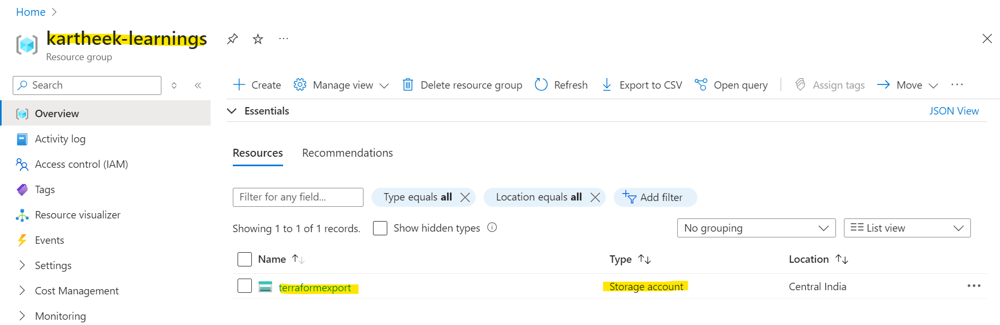
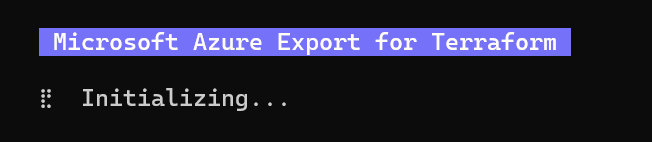
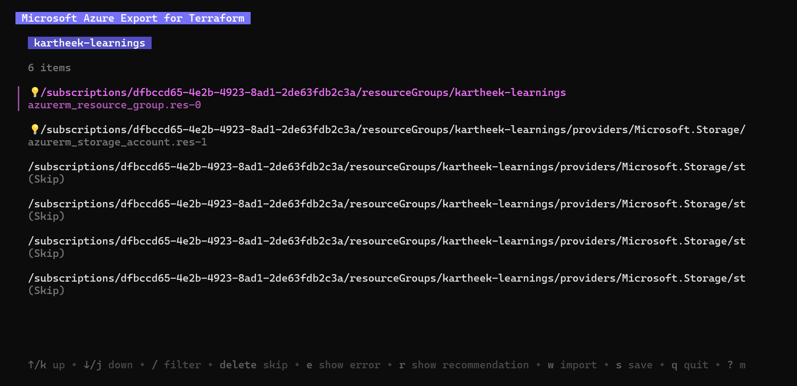
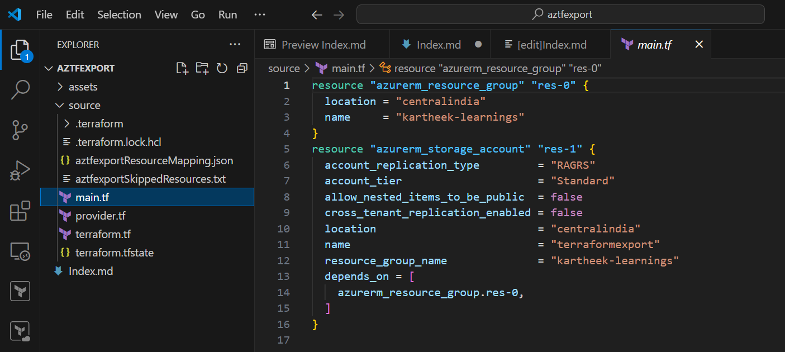
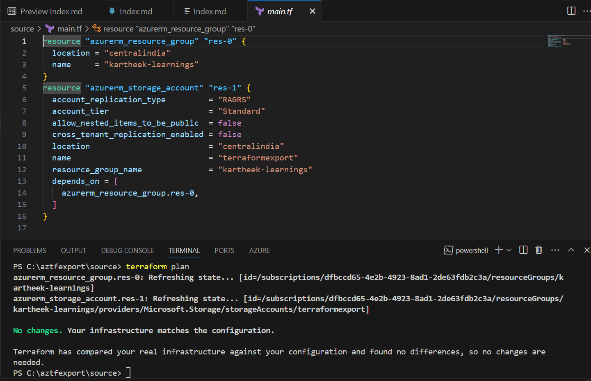
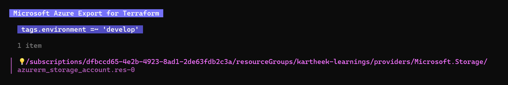
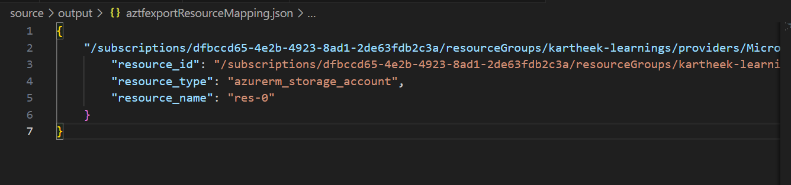

# Azure Terraform Export: Importing Resources with Aztfexport

**Azure Export Benefits**:

1. **Single Command**: It simplefies migration of up to hundreds of azure resources in a terraform HCL and its state with just a single command.
2. **Plan Apply Workflo**w: It supports Plan Apply workflows for moving non terraform infrastructure into your terraform environment.
3. **Expose All Properties**: It exposes all configurable terraform properties at your desired resource scope.
4. **Resource Filters**: It offers automated and manual filtering on your resource scope.

Let's dive into an example. We have a resource group and a storage account within a subscription that need to be brought under Terraform management. Since it's our first time working with Azure export, we want to explore its capabilities before proceeding.

We begin by exporting the resource group along with the storage account within the subscription that was created in the Azure Portal.

We start with exporting resource group with storage account within the subscription that got created in the Azure Portal.



`aztfexport resource-group kartheek-learnings`



After some seconds of loading we get greeted by the following user interface. We can make use of the arrow keys verify all my resources have been automatically identified and mapped to the corresponding AzureRM resource type.



Now press 'W' to export. We have managed to entire resource group into terraform State and HCL code.

**Output**:



Let's run `terraform plan` and we see no changes are needed. This is great it means we can begin managing the Azure




**Exporting Subscriptions**

We know that subscriptions has a ton of resources and want to export too many at once. Azure exports query command will help us here as it supports Azure resource graph query paramaters. We filter resources by the develop tag.

`aztfexport query "tags.environment =~ 'develop'"`



Now, let's open **aztfexportResourceMapping.json** , and we should see the resource we selected earlier.Now let's open **aztfexportResourceMapping.json**  and we shall see the above selected resource

```
{
	"/subscriptions/dfbccd65-4e2b-4923-8ad1-2de63fdb2c3a/resourceGroups/kartheek-learnings/providers/Microsoft.Storage/storageAccounts/terraformexport1": {
		"resource_id": "/subscriptions/dfbccd65-4e2b-4923-8ad1-2de63fdb2c3a/resourceGroups/kartheek-learnings/providers/Microsoft.Storage/storageAccounts/terraformexport1",
		"resource_type": "azurerm_storage_account",
		"resource_name": "res-0"
	}
}
```

**Let's use non-interactive flag**:

> aztfexport query --non-interactive --output-dir "output" "tags.environment =~ 'develop' and type =~ 'azurerm_storage_account'"

**Output**:



**References**

1. Azure Export GitHub: https://github.com/Azure/aztfexport
2. Azure Export Docs: https://aka.ms/tf/exportdocs
3. If you curious about the code please find link to the Github repo: https://github.com/kartheek91/TerraformLearningsAztfExport/
